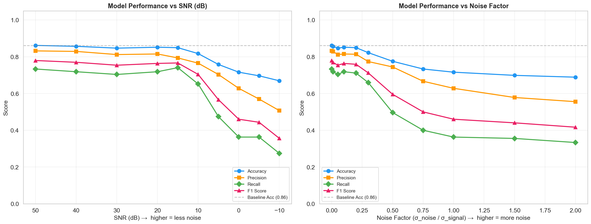
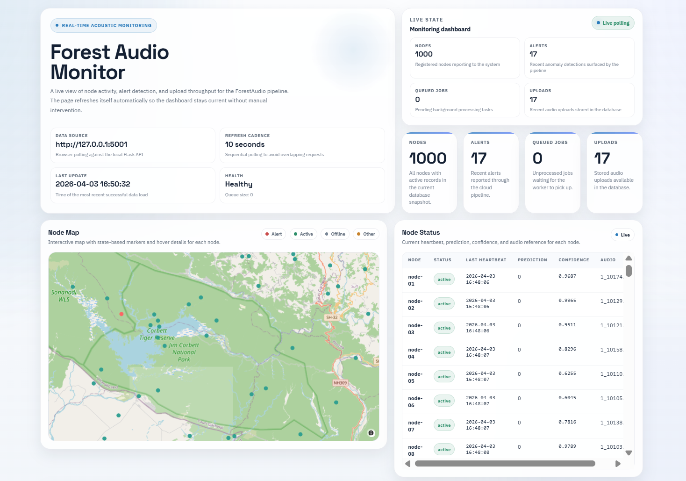
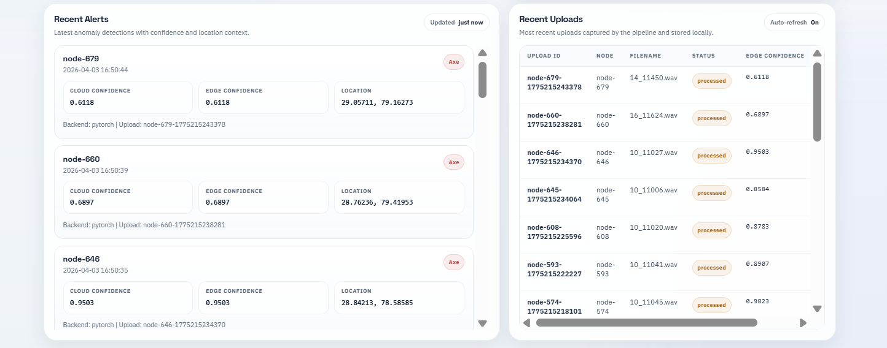
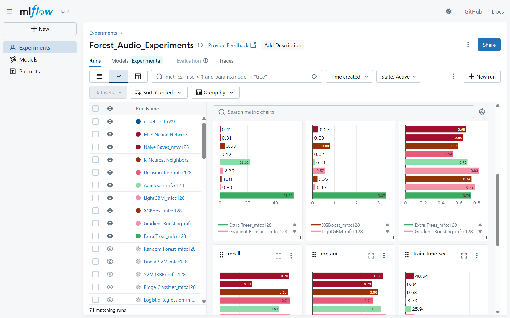
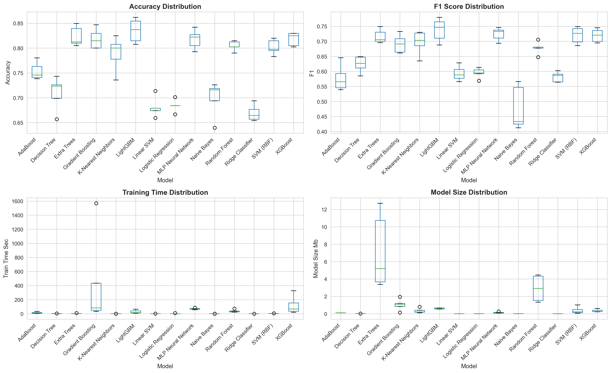
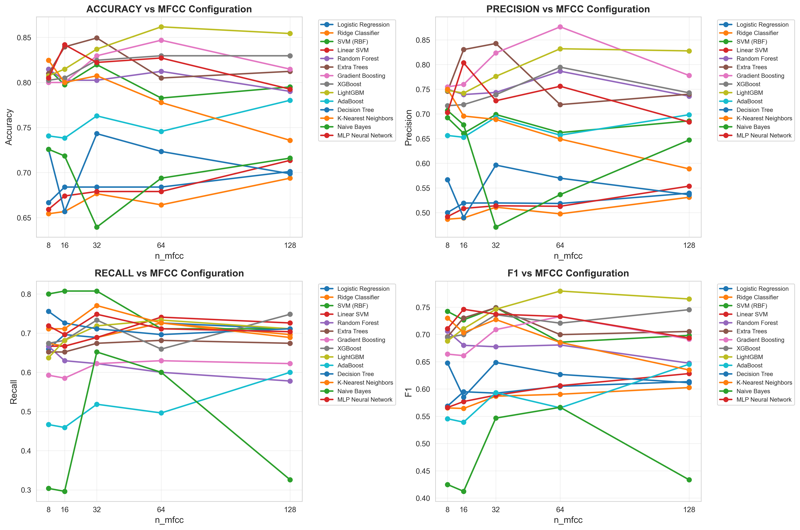
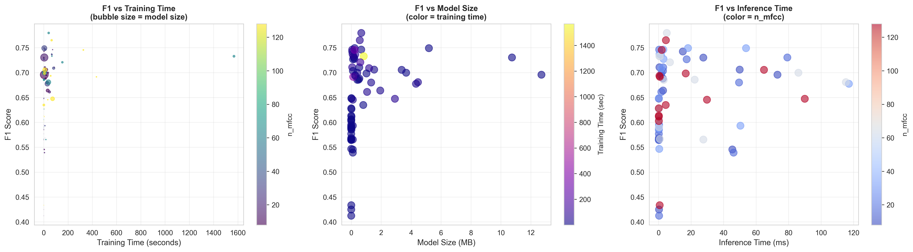

# ForestAudio

ForestAudio is a distributed, audio-based forest surveillance system that combines edge inference, cloud re-evaluation, and a live browser dashboard to detect likely illegal logging activity in near real time. The system is built as a local end-to-end application: audio clips are sampled to remote sensor nodes, evaluated on the edge, uploaded when suspicious, and then re-checked in the cloud before being shown in the dashboard.

## What The System Does

ForestAudio models a practical forest monitoring pipeline with three layers:

1. Edge nodes continuously sample audio every 20 seconds.
2. A lightweight edge model (LightGBM) scores each sample and forwards only suspicious clips.
3. A cloud worker reprocesses those uploads, stores alerts in SQLite, and serves a live dashboard for operational visibility.

The prototype is useful for showing how hierarchical acoustic monitoring can reduce bandwidth, keep latency low at the edge, and still preserve stronger cloud-side classification when needed.

## Architecture

The runtime flow is:

1. `python -m src.main run-all` starts the Flask API, background queue worker, and the simulator together.
2. The simulator in [src/simulator.py](src/simulator.py) creates a fleet of sensor nodes, assigns audio samples, and emits heartbeats to the cloud.
3. The edge engine in [src/edge.py](src/edge.py) loads the LightGBM model, predicts a class, and computes a binary edge decision.
4. If the edge score crosses the configured threshold, the sample is uploaded to the cloud through `/ingest` in [src/cloud.py](src/cloud.py).
5. The queue worker in [src/worker.py](src/worker.py) claims pending uploads, runs cloud-side inference, and records alerts.
6. The storage layer in [src/storage.py](src/storage.py) persists nodes, uploads, jobs, and alerts in `data/forest_audio.sqlite3`.
7. The dashboard in [index.html](index.html) polls the Flask API and shows live nodes, recent uploads, and recent alerts.

## Technology Stack

ForestAudio uses a lightweight local stack rather than a managed cloud deployment:

| Area | Technology |
| --- | --- |
| Web server | Flask |
| Edge and cloud inference | PyTorch, timm |
| Audio preprocessing | librosa, soundfile, NumPy |
| Storage | SQLite |
| Dashboard and charts | HTML, Plotly, Matplotlib |

Core runtime files:

| File | Purpose |
| --- | --- |
| [src/main.py](src/main.py) | Launches the API, worker, simulator, or full demo |
| [src/cloud.py](src/cloud.py) | Serves the API and dashboard, exposes health and data endpoints |
| [src/edge.py](src/edge.py) | Runs the edge-side model and thresholding logic |
| [src/worker.py](src/worker.py) | Processes queued uploads in the cloud layer |
| [src/audio.py](src/audio.py) | Handles audio loading and mel-spectrogram conversion |
| [src/storage.py](src/storage.py) | SQLite persistence for nodes, uploads, jobs, and alerts |
| [src/config.py](src/config.py) | Central configuration and environment-variable defaults |

## Application Flow

ForestAudio is intentionally structured as a closed-loop prototype so the whole pipeline can run on a single machine.

Edge flow:

- The environment simulator selects a sample for each node.
- The edge engine converts the audio clip to a mel-spectrogram input.
- The model predicts a class and a confidence score.
- The binary edge decision determines whether the clip is sent upstream.

Cloud flow:

- Uploaded clips are saved locally under `data/uploads/`.
- The worker claims the queued job from SQLite.
- The cloud model re-evaluates the upload and stores the result as an alert.
- The dashboard polls the Flask API and refreshes the live panels.

## Models And Results

ForestAudio compares both classical ML and deep learning approaches across edge and cloud layers. The project keeps the edge layer efficient and the cloud layer more expressive.

### Edge Layer Results

The strongest edge model is **LightGBM with 64 MFCCs**.

| Model | Accuracy | Precision | Recall | F1 |
| --- | --- | --- | --- | --- |
| LightGBM (64 MFCCs) | 0.8617 | 0.8319 | 0.7333 | 0.7795 |
| LightGBM under 30 dB noise | 0.8469 | 0.8120 | 0.7037 | 0.7540 |
| LightGBM under 10 dB noise | 0.8173 | 0.7652 | 0.6519 | 0.7040 |
| LightGBM under 0 dB noise | 0.7160 | 0.6282 | 0.3630 | 0.4601 |
| LightGBM under -10 dB noise | 0.6691 | 0.5068 | 0.2741 | 0.3558 |

The edge experiments show that 64 MFCCs provide the best trade-off between accuracy and efficiency, with sub-20 ms inference latency in the reported experiments.

### Cloud Layer Results

The cloud layer compares CNN and transformer baselines. The selected cloud model is **DEiT**.

| Model | Accuracy | Precision | Recall | F1 |
| --- | --- | --- | --- | --- |
| VGG16 | 0.69 | 0.69 | 0.70 | 0.68 |
| ResNet50 | 0.76 | 0.76 | 0.77 | 0.76 |
| DenseNet121 | 0.58 | 0.60 | 0.59 | 0.58 |
| InceptionV3 | 0.52 | 0.53 | 0.53 | 0.51 |
| VGG16 + CBAM | 0.79 | 0.80 | 0.81 | 0.80 |
| ResNet50 + CBAM | 0.78 | 0.75 | 0.75 | 0.74 |
| ViT | 0.7506 | - | - | - |
| SWIN Transformer | 0.8198 | - | - | - |
| DEiT | 0.86 | 0.86 | 0.86 | 0.85 |

The cloud results show that transformer models outperform simpler CNN baselines overall, with DEiT giving the strongest reported balance of accuracy and macro F1.

## Noise Robustness

The edge model was also evaluated under Gaussian noise to simulate degraded forest acoustics such as wind, rain, wildlife movement, and sensor noise.

Baseline clean performance:

- Accuracy: 0.8617
- Precision: 0.8319
- Recall: 0.7333
- F1: 0.7795

The model remains reasonably stable at high SNR, but performance declines as noise increases. At 0 dB SNR, F1 falls to 0.4601, and at -10 dB SNR it drops to 0.3558.



## Visual Results

### Live Dashboard



The main dashboard shows the map-based node view, live system health, queue status, and node-level status table.



This view highlights the alerts panel and recent upload history, including edge confidence and processing status.

### Experiment Tracking



The MLflow view shows the experiment comparison used to track model families and metrics during training.

### Model Behaviour



This figure compares accuracy, F1, training time, and model size across candidate models.



This figure shows how performance changes across MFCC feature sizes and model families.



This figure highlights the accuracy, latency, and size trade-offs that motivate the final model choices.

## Quick Start

1. Install dependencies:

	```bash
	pip install -r requirements.txt
	```

2. Start the full simulated pipeline:

	```bash
	python -m src.main run-all
	```

3. Open the dashboard in your browser:

	```text
	http://127.0.0.1:5001/
	```

Additional entrypoints:

- `python -m src.main api` starts only the Flask API.
- `python -m src.main worker` starts only the cloud queue worker.
- `python -m src.main simulate` starts only the simulator.
- `python -m src.dashboard` opens the dashboard URL in the browser.

## Configuration

ForestAudio is configured through environment variables defined in [src/config.py](src/config.py).

| Variable | Default | Description |
| --- | --- | --- |
| `FORESTAUDIO_SAMPLE_INTERVAL_SECONDS` | `20.0` | Sampling interval for the simulator |
| `FORESTAUDIO_HEARTBEAT_INTERVAL_SECONDS` | `60.0` | Heartbeat cadence for simulated nodes |
| `FORESTAUDIO_ANOMALY_RATE` | `0.3` | Fraction of samples drawn from the anomaly pool |
| `FORESTAUDIO_TARGET_CLASSES` | `1` | Target class IDs used by the edge gate |
| `FORESTAUDIO_EDGE_THRESHOLD` | `0.4` | Confidence threshold for edge-to-cloud upload |
| `FORESTAUDIO_CENTER_LAT` | `29.5521` | Default map center latitude |
| `FORESTAUDIO_CENTER_LON` | `78.8832` | Default map center longitude |
| `FORESTAUDIO_MAP_SPAN` | `0.99` | Spread of simulated node locations |
| `FORESTAUDIO_MAX_NODES` | `1000` | Number of simulated nodes |


## Summary

ForestAudio demonstrates how acoustic monitoring can be split into a fast edge gate and a stronger cloud classifier. The result is a practical, reproducible local system that shows the operational shape of distributed forest surveillance without requiring live hardware.